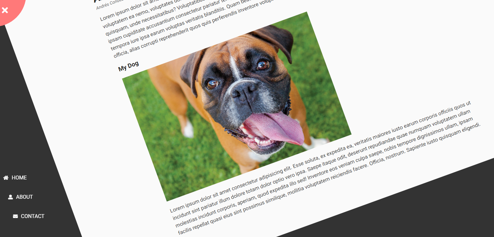

<h1 align=center>Rotating Navigation 🔄 </h1>

**This is the day 3** and this project is about rotate the entire website and show the navigation items.

**Technologies used:**

✔️HTML
 
✔️CSS
 
✔️javaScript
 

**Tools:**

- Neo Vim

> This project forms part of "50 Projects In 50 Days" series.

You can see a live preview here: https://andres-condezo.github.io/rotating/
